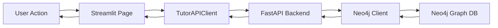

# Vocabulary Learning System

Comprehensive guide to the Italian vocabulary learning system with flashcards, Neo4j session tracking, and progress analytics.

## Overview

The vocabulary learning system provides a complete Italian language learning experience with:

- **Flashcard Review** - Confidence-based spaced repetition
- **Vocabulary Management** - Add, organize, and search words
- **Session Tracking** - Complete progress tracking in Neo4j
- **Analytics Dashboard** - Visual progress visualization
- **CEFR Alignment** - Language proficiency level tracking (A1-C2)

## Architecture

### System Overview

The vocabulary learning system follows a three-tier architecture:

```
┌──────────────────────────────────────────────────────────────┐
│                    Streamlit Frontend                        │
│  ┌──────────────┐  ┌──────────────┐  ┌──────────────┐       │
│  │ Vocabulary   │  │ Flashcard    │  │ Progress     │       │
│  │ Browser      │  │ Review       │  │ Dashboard    │       │
│  │ UI           │  │ Sessions     │  │ Analytics    │       │
│  └──────┬───────┘  └──────┬───────┘  └──────┬───────┘       │
│         │                  │                  │                │
│         └──────────────────┴──────────────────┘                │
│                            │                                   │
│                    ┌───────▼───────┐                          │
│                    │ TutorAPIClient│                          │
│                    └───────┬───────┘                          │
└────────────────────────────┼──────────────────────────────────┘
                              │ HTTP/REST
                              ▼
┌──────────────────────────────────────────────────────────────┐
│                    FastAPI Backend                           │
│  ┌──────────────┐  ┌──────────────┐  ┌──────────────┐       │
│  │ Vocabulary   │  │ Session      │  │ Analytics    │       │
│  │ API          │  │ API          │  │ API          │       │
│  └──────┬───────┘  └──────┬───────┘  └──────┬───────┘       │
│         │                  │                  │                │
│         └──────────────────┴──────────────────┘                │
│                            │                                   │
│                    ┌───────▼───────┐                          │
│                    │  Neo4j Client │                          │
│                    └───────┬───────┘                          │
└────────────────────────────┼──────────────────────────────────┘
                              │ Bolt Protocol
                              ▼
┌──────────────────────────────────────────────────────────────┐
│                    Neo4j Graph Database                      │
│  ┌──────────────┐  ┌──────────────┐  ┌──────────────┐       │
│  │ Vocabulary   │  │ Session      │  │ Student      │       │
│  │ Nodes        │  │ Nodes        │  │ Nodes        │       │
│  └──────┬───────┘  └──────┬───────┘  └──────┬───────┘       │
│         │                  │                  │                │
│  Relationships: KNOWS, COMPLETED_SESSION                     │
└──────────────────────────────────────────────────────────────┘
```

### Data Flow



## Key Components

```
┌──────────────────────────────────────────────────────────────┐
│                    Streamlit Frontend                        │
│  ┌──────────────┐  ┌──────────────┐  ┌──────────────┐       │
│  │ Vocabulary   │  │ Flashcard    │  │ Progress     │       │
│  │ Browser      │  │ Review       │  │ Dashboard    │       │
│  │ UI           │  │ Sessions     │  │ Analytics    │       │
│  └──────┬───────┘  └──────┬───────┘  └──────┬───────┘       │
│         │                  │                  │                │
│         └──────────────────┴──────────────────┘                │
│                            │                                   │
│                    ┌───────▼───────┐                          │
│                    │ TutorAPIClient│                          │
│                    └───────┬───────┘                          │
└────────────────────────────┼──────────────────────────────────┘
                             │ HTTP/REST
                             ▼
┌──────────────────────────────────────────────────────────────┐
│                    FastAPI Backend                           │
│  ┌──────────────┐  ┌──────────────┐  ┌──────────────┐       │
│  │ Vocabulary   │  │ Session      │  │ Analytics    │       │
│  │ API          │  │ API          │  │ API          │       │
│  └──────┬───────┘  └──────┬───────┘  └──────┬───────┘       │
│         │                  │                  │                │
│         └──────────────────┴──────────────────┘                │
│                            │                                   │
│                    ┌───────▼───────┐                          │
│                    │  Neo4j Client │                          │
│                    └───────┬───────┘                          │
└────────────────────────────┼──────────────────────────────────┘
                             │ Bolt Protocol
                             ▼
┌──────────────────────────────────────────────────────────────┐
│                    Neo4j Graph Database                      │
│  ┌──────────────┐  ┌──────────────┐  ┌──────────────┐       │
│  │ Vocabulary   │  │ Session      │  │ Student      │       │
│  │ Nodes        │  │ Nodes        │  │ Nodes        │       │
│  └──────┬───────┘  └──────┬───────┘  └──────┬───────┘       │
│         │                  │                  │                │
│  Relationships: KNOWS, COMPLETED_SESSION                     │
└──────────────────────────────────────────────────────────────┘
```

## Data Models

### Vocabulary Node

```cypher
CREATE (v:Vocabulary {
    word: STRING,           // Italian word
    definition: STRING,     // English translation  
    topic: STRING,          // Category/theme
    part_of_speech: STRING  // noun, verb, adjective, etc.
})
```

### Student-Vocabulary Relationship

```cypher
CREATE (s:Student {student_id: STRING})-[rel:KNOWS {
    confidence: FLOAT,      // 0.0 - 1.0 mastery level
    learned_at: DATETIME,   // When word was added
    last_reviewed: DATETIME,
    next_review: DATETIME   // For SRS scheduling
}]->(v:Vocabulary)
```

### Session Node

```cypher
CREATE (sess:Session {
    session_type: STRING,         // flashcard_review, practice, etc.
    started_at: DATETIME,
    completed_at: DATETIME,
    words_reviewed: INTEGER,
    correct_answers: INTEGER,
    accuracy: FLOAT,              // Percentage 0-100
    duration_seconds: INTEGER,
    details: JSON
})
```

### Session-Student Relationship

```cypher
CREATE (s:Student)-[rel:COMPLETED_SESSION]->(sess:Session)
```

## Key Components

### 1. Vocabulary Browser (`04_vocabulary.py:205-264`)

Interactive vocabulary list with:

- **CEFR Level Filtering** - Filter by A1-C2 levels
- **Search Functionality** - Search by Italian word
- **Responsive Grid** - 3-column card layout
- **Confidence Indicators** - Visual mastery bars
- **Topic Tags** - Category organization

### 2. Flashcard Review (`04_vocabulary.py:102-186`)

Confidence-based flashcard system with three assessment levels:

| Emoji | Label | Score | Meaning |
|-------|-------|-------|---------|
| ❌ | Not at all | 0% | No knowledge |
| 🤔 | Somewhat | 50% | Partial recognition |
| ✅ | Confident | 100% | Fully confident |

```python
def run_flashcard_review(vocabulary: list[dict], num_cards: int = 10) -> dict:
    """Run flashcard review session and track results."""
    cards = random.sample(vocabulary, min(num_cards, len(vocabulary)))
    
    for card in cards:
        # Display card
        st.markdown(f"### {card.get('italian_word')}")
        st.caption(f"**English:** {card.get('english_translation')}")
        
        # Confidence assessment
        confidence = st.radio(
            "",
            options=["❌ Not at all", "🤔 Somewhat", "✅ Confident"],
            key=f"conf_{i}",
            horizontal=True,
        )
```

### 3. Flashcard Review (`04_vocabulary.py:102-186`)

Confidence-based flashcard system with three assessment levels:

| Emoji | Label | Score | Meaning |
|-------|-------|-------|---------|
| ❌ | Not at all | 0% | No knowledge |
| 🤔 | Somewhat | 50% | Partial recognition |
| ✅ | Confident | 100% | Fully confident |

```python
def run_flashcard_review(vocabulary: list[dict], num_cards: int = 10) -> dict:
    """Run flashcard review session and track results."""
    cards = random.sample(vocabulary, min(num_cards, len(vocabulary)))
    
    for card in cards:
        # Display card
        st.markdown(f"### {card.get('italian_word')}")
        st.caption(f"**English:** {card.get('english_translation')}")
        
        # Confidence assessment
        confidence = st.radio(
            "",
            options=["❌ Not at all", "🤔 Somewhat", "✅ Confident"],
            key=f"conf_{i}",
            horizontal=True,
        )
```

### 4. Session Tracking (`learning.py:247-373`)

Complete session history in Neo4j:

**Methods:**
- `create_session()` - Create new session node
- `update_session()` - Update with metrics
- `get_session_history()` - Retrieve session data

```python
async def create_session(
    self,
    student_id: str,
    session_type: str,
    details: dict | None = None,
) -> str:
    """Create a new learning session in Neo4j."""
    query = """
    MERGE (s:Student {student_id: $student_id})
    CREATE (sess:Session {
        session_type: $session_type,
        started_at: datetime(),
        details: $details,
        completed_at: datetime()
    })
    MERGE (s)-[:COMPLETED_SESSION]->(sess)
    RETURN elementId(sess) AS session_id
    """
```

### 4. Progress Dashboard (`04_vocabulary.py:397-452`)

Visual analytics showing:

- **CEFR Distribution** - Word distribution by level
- **Session Statistics** - Recent session metrics
- **History Timeline** - Last 5 completed sessions
- **Accuracy Trends** - Performance tracking

## API Integration

### TutorAPIClient Methods (`tutor_api.py:494-554`)

```python
def create_session(
    self,
    student_id: str,
    session_type: str,
    details: dict | None = None,
) -> dict | None:
    """Create a new learning session in Neo4j."""
    result = self._request(
        "POST",
        f"/session/{student_id}",
        json_data={
            "session_type": session_type,
            "details": details or {},
        },
    )
    return result
```

### Session Flow

```
User starts flashcard review
    ↓
run_flashcard_review() collects results
    ↓
track_session() called with metrics
    ↓
api.create_session() POST to /session/{student_id}
    ↓
FastAPI creates Session node in Neo4j
    ↓
Session ID returned to frontend
    ↓
Dashboard displays session history
```

## Usage Guide

### For Students

1. **Access Vocabulary Page**
   - Navigate to Streamlit dashboard
   - Click "Vocabulary" tab
   - View your vocabulary list

2. **Review with Flashcards**
   - Select "Flashcard Review" tab
   - Choose CEFR level (optional)
   - Select number of cards (5-50)
   - Click "Start Flashcard Review"
   - Rate confidence for each card

3. **Track Progress**
   - View "Progresso" tab
   - Check CEFR distribution
   - Review session history
   - Monitor accuracy improvements

4. **Add New Words**
   - Click "Aggiungi Nuova Parola" tab
   - Enter Italian word
   - Add English translation
   - Select part of speech and CEFR level
   - Submit to add to vocabulary

### For Developers

#### Setting Up

1. **Configure Neo4j Connection**
   ```python
   NEO4J_URI="bolt://localhost:7687"
   NEO4J_USERNAME="neo4j"
   NEO4J_PASSWORD="your_password"
   ```

2. **Run Streamlit Frontend**
   ```bash
   poetry run streamlit run \
       src/italianollama/frontend/streamlit/app_enhanced.py \
       --server.port 8502
   ```

3. **Access Vocabulary Page**
   - Navigate to `http://localhost:8502/vocabulary`
   - View flashcard review and analytics

#### Key Functions

```python
# Get vocabulary items
@st.cache_data(ttl=120)
def get_vocabulary_items(due_for_review: bool = False, level_filter: str = None):
    """Fetch vocabulary with caching and optional filtering."""
    vocabulary = api.get_vocabulary(student_id, due_for_review=due_for_review)
    if level_filter and level_filter != "All":
        vocabulary = [w for w in vocabulary if w.get("cefr_level") == level_filter]
    return vocabulary

# Track session
def track_session(session_type: str, details: dict):
    """Track session in Neo4j via TutorAPIClient."""
    try:
        result = api.create_session(student_id, session_type, details)
        if result:
            st.session_state.last_session = result
            st.session_state.session_history = api.get_session_history(student_id, limit=10)
    except Exception as e:
        st.debug(f"Session tracking logged (API unavailable): {str(e)}")

# Run flashcard review
def run_flashcard_review(vocabulary: list[dict], num_cards: int = 10) -> dict:
    """Run flashcard review session and track results."""
    cards = random.sample(vocabulary, min(num_cards, len(vocabulary)))
    
    results = {
        "total": len(cards),
        "correct": 0,
        "incorrect": 0,
        "session_words": [],
    }
    
    for card in cards:
        # Display and assess
        confidence = get_user_confidence()
        
        if confidence == "✅ Confident":
            results["correct"] += 1
        elif confidence == "🤔 Somewhat":
            results["correct"] += 0.5
    
    accuracy = (results["correct"] / results["total"]) * 100
    
    track_session("flashcard_review", {
        "words_reviewed": results["total"],
        "correct_answers": results["correct"],
        "accuracy": round(accuracy, 1),
    })
    
    return results
```

## CEFR Level System

### Level Breakdown

| Level | Description | Vocabulary Target |
|-------|-------------|-------------------|
| A1 | Beginner | 500 words |
| A2 | Elementary | 1000 words |
| B1 | Intermediate | 2000 words |
| B2 | Upper Intermediate | 4000 words |
| C1 | Advanced | 6000 words |
| C2 | Proficiency | 8000+ words |

### Level Distribution

The system tracks vocabulary distribution across CEFR levels:

```python
# Example CEFR distribution
levels_count = {
    "A1": 45,  # 30%
    "A2": 60,  # 40%
    "B1": 35,  # 23%
    "B2": 10,  # 7%
}

for level, count in levels_count.items():
    pct = (count / total_words) * 100
    st.progress(pct / 100, text=f"{level}: {count} ({pct:.1f}%)")
```

## Session Metrics

### Tracked Data

Each session records:

```python
session_data = {
    "student_id": "uuid",
    "session_type": "flashcard_review",
    "started_at": "2026-04-03T10:30:00",
    "completed_at": "2026-04-03T10:45:00",
    "words_reviewed": 10,
    "correct_answers": 9,
    "accuracy": 90.0,
    "duration_seconds": 900,
    "details": {
        "flashcards_shown": 10,
        "level_filter": "B1",
    }
}
```

### Dashboard Metrics

```python
# Calculate statistics
total_sessions = len(session_history)
avg_accuracy = sum(s.get("accuracy", 0) for s in session_history) / total_sessions
total_words = sum(s.get("words_reviewed", 0) for s in session_history)

st.metric("Sessioni Totali", total_sessions)
st.metric("Accuracy Media", f"{avg_accuracy:.1f}%")
st.metric("Parole Totali", total_words)
```

## Performance Optimization

### Caching Strategy

```python
# Vocabulary caching (2 minutes)
@st.cache_data(ttl=120)
def get_vocabulary_items(due_for_review: bool = False, level_filter: str = None):
    vocabulary = api.get_vocabulary(student_id, due_for_review=due_for_review)
    if level_filter and level_filter != "All":
        vocabulary = [w for w in vocabulary if w.get("cefr_level") == level_filter]
    return vocabulary

# CEFR levels caching (5 minutes)
@st.cache_data(ttl=300)
def get_cefr_levels(student_id: str):
    vocabulary = api.get_vocabulary(student_id)
    levels = set(w.get("cefr_level", "A1") for w in vocabulary)
    return sorted(levels)
```

### Query Optimization

```cypher
# Indexed queries on student_id
MATCH (s:Student {student_id: $student_id})-[:COMPLETED_SESSION]->(sess:Session)

# Efficient session history retrieval
RETURN {
    session_type: sess.session_type,
    started_at: sess.started_at,
    words_reviewed: COALESCE(sess.words_reviewed, 0),
    accuracy: COALESCE(sess.accuracy, 0.0)
} AS session
ORDER BY sess.started_at DESC
LIMIT $limit
```

## Troubleshooting

### Common Issues

**Session not tracking in Neo4j**
- Check Neo4j connection and credentials
- Verify student_id exists in database
- Check for exceptions in logs

**Flashcard review empty**
- Verify vocabulary exists for selected level
- Check student ID in session state
- Add vocabulary words to database

**Slow page load**
- Check database indexes
- Clear cache with `st.cache_data.clear()`
- Verify Neo4j performance

## Best Practices

### 1. Session Naming

Use lowercase with underscores:
```python
track_session("flashcard_review", details)
track_session("vocabulary_practice", details)
```

### 2. Accuracy Calculation

Always use float division:
```python
accuracy = (correct / total) * 100  # Correct: 9/10 = 90.0%
# Avoid: (correct // total) * 100  # Wrong: 9//10 = 0%
```

### 3. Error Handling

Wrap session tracking:
```python
try:
    track_session("flashcard_review", session_details)
except Exception as e:
    logger.warning(f"Session tracking failed: {e}")
```

## Related Documentation

- [Flashcard Review](../features/flashcard-review.md) - Detailed flashcard system guide
- [Session Tracking](../features/session-tracking.md) - Neo4j session tracking details
- [Progress Tracking](../features/progress-tracking.md) - Overall progress tracking
- [Features Index](../features/INDEX.md) - All feature documentation
- [Database Schema](../architecture/database.md) - Neo4j data models
- [API Endpoints](../api/endpoints.md) - Backend API reference

## Future Enhancements

- [ ] Full SM-2 spaced repetition algorithm
- [ ] Italian-Italian definitions
- [ ] Example sentences per word
- [ ] Pronunciation audio recordings
- [ ] Practice quizzes per CEFR level
- [ ] Daily review scheduling
- [ ] Gamification (XP, badges, achievements)
- [ ] Word categories and subcategories
- [ ] Proficiency tests per CEFR level
- [ ] Image-based flashcards
